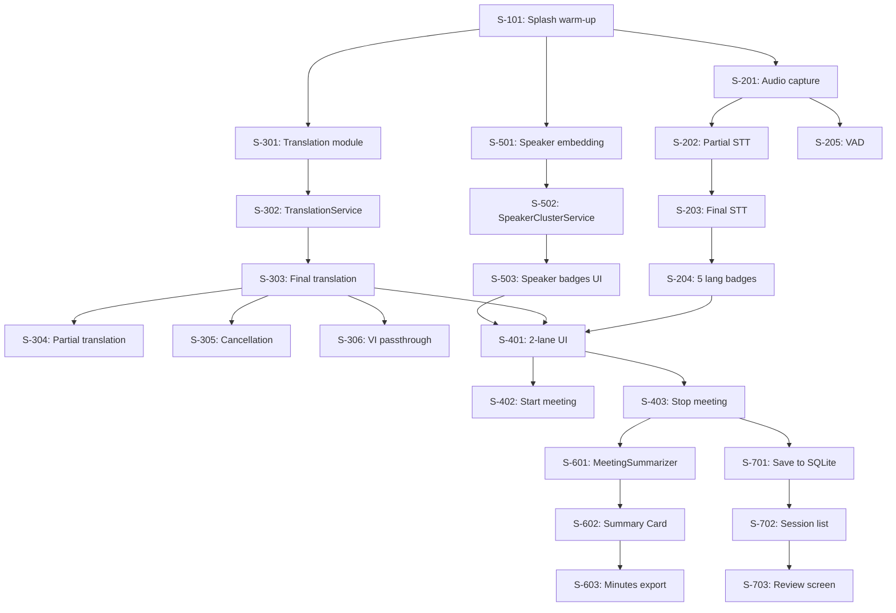

# Epics & User Stories — Meeting Voice Assistant

**Author:** nghinh  
**Date:** 2026-04-18  
**Version:** 4.0 (Offline — Platform-Native Translation)  
**Status:** Approved  
**Change from v3.0:** Model download epic removed (bundled), NLLB stories replaced with platform-native translation, speaker diarization epic added, meeting minutes epic added, 5 languages.

---

## Overview

7 epics decomposed into 35 user stories. MVP delivers Epics 1-4 (core meeting flow). Epics 5-7 are post-MVP features.

**Milestone mapping:**

| Phase | Epics | Timeline | Deliverable |
|-------|-------|----------|-------------|
| Foundation | E1 (Model Warm-up), E2 (STT) | Week 1-2 | Models load from bundle, Whisper STT works |
| Core Translation | E3 (Translation) | Week 3-4 | Platform-native translation working |
| Meeting Flow | E4 (Meeting UI) | Week 5-6 | Full 2-lane meeting screen with 5 languages |
| Speaker Tracking | E5 (Speaker Diarization) | Week 7 | Speaker labels on all utterances |
| Meeting Minutes | E6 (Minutes & Summary) | Week 8 | Summary card, action items, topic segments, export |
| Polish | E7 (Sessions, Settings, Polish) | Week 9 | Persistence, export, settings, dark mode |

---

## Epic 1: Model Management (Bundled — No Download)

**Goal:** Load and warm up bundled AI models on app start so all inference runs offline with no cold-start penalty.

| ID | Story | Priority | Points |
|----|-------|----------|--------|
| S-101 | As a user, I want the app to launch with a splash screen showing warm-up progress so I know models are loading. | Must | 3 |
| S-102 | As a developer, I want all models (Whisper-Small STT, Speaker Diarization, Opus-MT [Android]) to warm up during splash with dummy inference. | Must | 5 |
| S-103 | As a user, I want the splash warm-up to complete within 8 seconds on iPhone 14 Pro Max. | Must | 2 |

**Notes:**
- All models are bundled in the app binary — no download, no network check, no resume logic.
- Splash status cycles: "Loading speech engine..." → "Loading speaker detection..." → "Ready!"
- iOS does not need translation model warm-up (Apple Translation is managed by OS).

---

## Epic 2: On-Device Speech-to-Text (Whisper-Small)

**Goal:** Capture room audio and transcribe EN/JA/KO/ZH/VI speech in real time on-device.

| ID | Story | Priority | Points |
|----|-------|----------|--------|
| S-201 | As a user, I want the app to capture room audio at 16kHz continuously while the meeting session is active. | Must | 3 |
| S-202 | As a user, I want to see partial transcription text updating in real time as someone speaks. | Must | 5 |
| S-203 | As a user, I want finalized transcription when silence > 600ms, clearly distinguished from partial. | Must | 3 |
| S-204 | As a user, I want each utterance to show which language was detected (EN/JA/KO/ZH/VI badge). | Must | 3 |
| S-205 | As a user, I want VAD to filter silence and background noise. | Must | 3 |

**Technical notes:**
- Model: Whisper-Small int8 (~244MB), auto-detect EN/JA/KO/ZH/VI, `task: 'transcribe'`
- Audio pipeline: Mic → PCM 16kHz → Silero VAD → Whisper-Small → text + lang events to JS
- Language badges: EN=blue(#3B82F6), JA=red(#EF4444), KO=green(#22C55E), ZH=orange(#F97316), VI=purple(#8B5CF6)

---

## Epic 3: On-Device Translation (Platform-Native)

**Goal:** Translate STT output to Vietnamese using platform-native engines with zero network dependency.

| ID | Story | Priority | Points |
|----|-------|----------|--------|
| S-301 | As a developer (iOS), I want an `AppleTranslatorModule` TurboModule that wraps Apple Translation Framework for on-device translation. | Must | 8 |
| S-301a | As a developer (Android), I want an `OpusMtTranslatorModule` TurboModule that wraps Opus-MT tiny models via ONNX Runtime, with two-hop strategy for JA/KO/ZH. | Must | 8 |
| S-302 | As a developer, I want a unified `TranslationService.ts` that abstracts iOS/Android differences so JS code calls the same API. | Must | 3 |
| S-303 | As a user, I want each finalized transcript to be translated to Vietnamese and displayed in the Translation Lane. | Must | 5 |
| S-304 | As a user, I want partial translations (≥5 words) to appear as "drafts". | Should | 5 |
| S-305 | As a developer, I want translation to be cancellable when new STT arrives. | Must | 3 |
| S-306 | As a user, I want Vietnamese speech to appear in both lanes without translation, with a "native" indicator. | Must | 3 |

**Acceptance criteria for S-301 (iOS):**
- When JS calls `translationService.translate("Hello world", "en")` then returns Vietnamese within 500ms
- Uses Apple Translation Framework's `TranslationSession.translate()` API
- Runs on Neural Engine, not CPU
- If language pack not installed, iOS auto-prompts download (~50MB per pair, one-time)

**Acceptance criteria for S-301a (Android):**
- `opus-mt-en-vi` always loaded (~80MB RAM)
- For JA/KO/ZH: load source→EN model on demand, translate to EN, then EN→VI
- Maximum 2 models loaded simultaneously (~160MB RAM)
- Model swap when detected language changes (~200ms)

---

## Epic 4: Meeting Screen UI (2-Lane + Speaker Badges)

**Goal:** Build the core 2-lane meeting screen with transcript + translation + speaker badges.

| ID | Story | Priority | Points |
|----|-------|----------|--------|
| S-401 | As a user, I want a meeting screen with two vertically stacked lanes — Transcript and Translation — each independently scrollable. | Must | 5 |
| S-402 | As a user, I want a "Start Meeting" button on home screen that begins audio capture, STT, and translation. | Must | 3 |
| S-403 | As a user, I want a "Stop Meeting" button that ends session, generates meeting minutes, and saves all data. | Must | 3 |
| S-404 | As a user, I want a recording indicator (pulsing red dot + elapsed timer) and detected language badge in the top bar. | Must | 2 |
| S-405 | As a user, I want both lanes to auto-scroll with a "Jump to latest" button if I scroll up. | Must | 3 |
| S-406 | As a user, I want a waiting state showing "Listening..." with supported languages listed (EN/JA/KO/ZH/VI). | Should | 2 |

---

## Epic 5: Speaker Diarization

**Goal:** Label each utterance with a speaker identifier (Speaker 1, Speaker 2, ...) using on-device models.

| ID | Story | Priority | Points |
|----|-------|----------|--------|
| S-501 | As a developer, I want to extract 192-dim speaker embeddings from each utterance using CAM++ model via sherpa-onnx. | Should | 5 |
| S-502 | As a developer, I want a SpeakerClusterService that clusters embeddings with 3-zone cosine similarity, L2 normalization, temporal bias, and auto-merge. | Should | 8 |
| S-503 | As a user, I want colored speaker badges (S1/S2/S3) next to each utterance in both lanes. | Should | 5 |
| S-504 | As a user, I want speaker diarization to be non-blocking — if it fails, utterances still display normally. | Must | 2 |
| S-505 | As a user, I want a "Recalculate Speakers" button on the Review Screen to retroactively re-cluster all embeddings. | Should | 3 |

**Technical notes:**
- Models bundled: pyannote segmentation (~5MB) + CAM++ embedding (~30MB)
- Recommended variant: `campplus_sv_zh_en_16k-common_advanced.onnx` (28.3MB, trained on ZH+EN)
- Skip diarization for utterances <1 second
- Auto-recalculate clusters every 10 utterances
- Clusters reset per session

---

## Epic 6: Meeting Minutes & Summary

**Goal:** Auto-generate structured meeting minutes with extractive summary when session ends.

| ID | Story | Priority | Points |
|----|-------|----------|--------|
| S-601 | As a developer, I want a MeetingSummarizer service with KeywordExtractor (TF-IDF), SentenceScorer (6 signals), ActionItemDetector (multilingual patterns), and TopicSegmenter (time-gap). | Should | 8 |
| S-602 | As a user, I want a Summary Card on the Review Screen showing key points, action items, and keywords. | Should | 5 |
| S-603 | As a user, I want to export full meeting minutes as a Markdown file with metadata, summary, topics, speaker stats, and full transcript. | Should | 5 |
| S-604 | As a user, I want topic segments displayed between the summary card and the transcript timeline on Review Screen. | Should | 3 |

**Technical notes:**
- Pure TypeScript — no AI/LLM. Zero additional RAM.
- Processing <500ms for 50-utterance meeting.
- Keyword extraction on Vietnamese translations (with Vietnamese + Chinese stopwords).
- Action detection patterns: EN ("need to"), JA ("する必要"), KO ("해야"), ZH ("需要"), VI ("cần phải").

---

## Epic 7: Session Persistence, Settings & Polish

**Goal:** Save meetings, manage settings, and final polish.

| ID | Story | Priority | Points |
|----|-------|----------|--------|
| S-701 | As a user, I want each session (transcript + translations + speaker labels + summary) saved to SQLite when meeting stops. | Must | 5 |
| S-702 | As a user, I want a list of past sessions on Home with date, duration, languages, speaker count, utterance count. | Must | 3 |
| S-703 | As a user, I want to tap a past session and see the Review Screen with summary + timeline. | Must | 3 |
| S-704 | As a user, I want to delete individual sessions or all data. | Must | 2 |
| S-705 | As a user, I want a Settings screen showing model info (Whisper-Small, Apple/Opus-MT, CAM++), all "Bundled & Ready". | Should | 2 |
| S-706 | As a user, I want a diarization sensitivity slider in Settings. | Should | 2 |
| S-707 | As a developer, I want a dev mode showing real-time metrics overlay. | Could | 3 |
| S-708 | As a user, I want the app in both light and dark mode, respecting system preference. | Should | 3 |

---

## Story Dependency Graph

---

## Velocity & Sprint Planning

**Estimated total:** 35 stories, ~150 story points

| Sprint (1 week) | Stories | Points | Goal |
|-----------------|---------|--------|------|
| Sprint 1 | S-101, S-102, S-103, S-201, S-205 | 16 | Models warm up, audio captured, VAD works |
| Sprint 2 | S-202, S-203, S-204, S-301 | 19 | Whisper STT works, Apple Translation module (iOS) |
| Sprint 3 | S-301a, S-302, S-305 | 14 | Opus-MT module (Android), TranslationService unified |
| Sprint 4 | S-303, S-304, S-306, S-401, S-404 | 20 | Translation works both platforms, 2-lane UI |
| Sprint 5 | S-402, S-403, S-405, S-406 | 11 | Meeting flow end-to-end |
| Sprint 6 | S-501, S-502, S-503, S-504, S-505 | 23 | Speaker diarization complete |
| Sprint 7 | S-601, S-602, S-603, S-604 | 21 | Meeting minutes & summary |
| Sprint 8 | S-701, S-702, S-703, S-704 | 13 | Session persistence + history |
| Sprint 9 | S-705, S-706, S-707, S-708 | 10 | Settings, dev mode, dark mode |

**Critical path:** S-101 → S-301/S-301a → S-302 → S-303 → S-401 → S-403 → S-701

The longest poles are **S-301 (Apple Translation TurboModule, 8 pts)** and **S-301a (Opus-MT TurboModule, 8 pts)** — these are the platform-specific native modules. They can be developed in parallel by iOS and Android developers.

Secondary critical path for speaker diarization: S-501 → S-502 (SpeakerClusterService, 8 pts) → S-503. This runs in parallel with the translation track.
